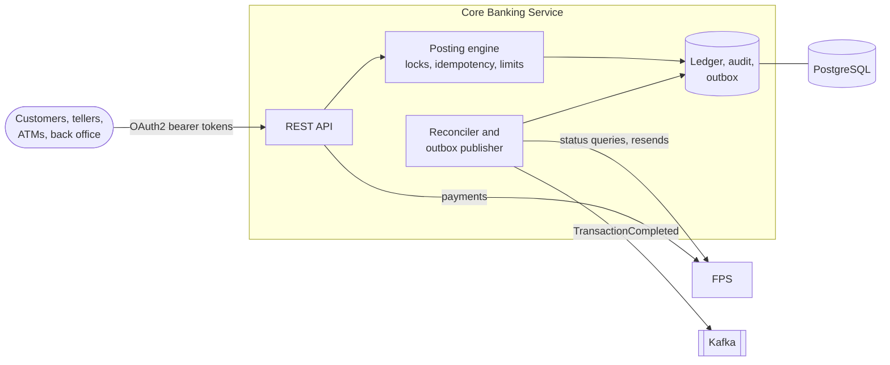

# Core Banking Service

[](https://github.com/zhlzxa/core-banking-service/actions/workflows/ci.yml)

A core banking backend focused on the parts of a banking system that are
genuinely hard to get right: atomic money movement on a double-entry
ledger, idempotent payment APIs, concurrency control and an auditable
record of every business action.

**Stack:** Java 21 · Spring Boot 4 · PostgreSQL 17 · JDBC and JPA · Flyway · Kafka · OAuth2/OIDC · Micrometer · Testcontainers · Docker

## Quick start

Prerequisites: Docker, and a Bash shell with `curl` and `openssl`.

```bash
demo/up.sh                      # build the image; start PostgreSQL, Kafka and the service with sample data
demo/idempotency.sh             # a retried transfer executes once
demo/insufficient-balance.sh    # a rejected transfer leaves no trace
demo/fps-timeout.sh             # a lost FPS response is resolved by reconciliation, never refunded
demo/four-eyes-withdrawal.sh    # a large cash withdrawal needs a second teller
docker compose --profile demo down
```

Swagger UI is at <http://localhost:8080/swagger-ui.html>; `demo/token.sh`
prints a token to paste into it. Probes and metrics are on the management
port: <http://localhost:8081/actuator/prometheus>. The demo signs its own
tokens with a key pair generated locally by `demo/generate-keys.sh`; no
real environment trusts it.

To build and run the tests (JDK 21; PostgreSQL and Kafka start in containers):

```bash
./mvnw verify
```

To run the service from the IDE against the compose database and broker and
an external OpenID Connect provider:

```bash
docker compose up -d
export OIDC_ISSUER_URI=https://idp.example.com/realms/bank OIDC_AUDIENCE=core-banking-api
SPRING_PROFILES_ACTIVE=dev ./mvnw spring-boot:run
```

## Architecture



Every money movement goes through one posting engine inside one database
transaction; calls to FPS and Kafka happen outside it. See
[docs/architecture.md](docs/architecture.md) for the sequence of a transfer
including its failure paths, the FPS flow and the consistency model.

## What it guarantees

- **Atomicity.** A transfer debits, credits, writes both ledger legs and
  completes its transaction record in one database transaction. A failure at
  any step leaves no trace.
- **Double-entry ledger.** Every transaction produces balanced, append-only
  ledger entries; the database rejects updates and deletes of ledger rows.
- **Idempotency.** Each request carries a client-generated `requestId`.
  Retries return the original result; reusing a key for a different
  instruction is rejected. See [ADR-0002](docs/adr/0002-idempotency-through-a-unique-request-id.md).
- **Concurrency safety.** Accounts are locked in ascending id order, so
  concurrent transfers never overdraw an account and never deadlock. See
  [ADR-0001](docs/adr/0001-lock-accounts-in-ascending-id-order.md).
- **Account controls.** Frozen and dormant accounts can receive but not send;
  closed accounts do neither. Amounts must fit the currency's minor units.
  Per-transaction and daily limits hold under concurrency and reset at
  midnight Hong Kong time. See
  [ADR-0007](docs/adr/0007-enforce-cumulative-limits-with-an-atomic-conditional-upsert.md).
- **Payments to other banks.** FPS payments debit the customer in one
  transaction, call FPS outside any transaction and record the answer in
  another. A timeout never refunds: the payment stays processing and is
  reconciled with FPS, resent with the same end-to-end id if FPS never saw it,
  or escalated for investigation. Rejections are undone with reversal
  transactions. See [ADR-0009](docs/adr/0009-treat-payment-timeouts-as-unknown-and-reconcile.md)
  and [ADR-0010](docs/adr/0010-correct-postings-with-reversal-transactions.md).
- **Reliable events.** Every completed movement produces a
  `TransactionCompleted` event, written to an outbox table in the same
  transaction and published to Kafka afterwards. No event is lost and none
  describes a movement that rolled back; consumers deduplicate by event id.
  See [ADR-0011](docs/adr/0011-publish-events-through-a-transactional-outbox.md).
- **Cash channels.** Tellers take in and pay out cash at a branch; large
  withdrawals need a second teller's approval (four eyes). ATMs authenticate
  as machines, not users. Every action records who acted, for which customer,
  and through which channel. See
  [ADR-0008](docs/adr/0008-attribute-staff-and-machine-actions-to-the-customer.md).
- **Layered authorization.** Callers authenticate with OAuth2 bearer tokens
  from an external OpenID Connect provider. Every transfer checks the token
  scope, the caller's bank role and ownership of the source account. See
  [ADR-0003](docs/adr/0003-delegate-authentication-to-an-oidc-provider.md).
- **Audit trail.** Every transfer outcome and every security rejection is
  recorded with the authenticated actor and correlation id. Success is audited
  atomically with the money movement; rejected attempts are audited in an
  independent transaction so they survive the rollback. See
  [ADR-0004](docs/adr/0004-audit-success-in-transaction-and-failure-independently.md).
- **Scalable history.** Transaction history uses keyset pagination backed by
  purpose-built indexes, so every page costs the same regardless of depth and
  pages stay stable while new transactions arrive. See
  [ADR-0005](docs/adr/0005-keyset-pagination-for-transaction-history.md).
- **Operable.** JSON logs carry the request's correlation id and never
  tokens or account numbers. Liveness and readiness are separate probes.
  Prometheus metrics cover business outcomes, FPS latency and the backlogs
  that need attention, with alerts and procedures in the
  [runbook](docs/runbook.md).
- **Safe error contract.** Every error is an RFC 9457 problem response with a
  stable `code` and the request's correlation id; internal details never leak
  to clients. See [docs/api-errors.md](docs/api-errors.md).

These properties are verified by integration tests against a real PostgreSQL
instance, including concurrent scenarios and injected failures.

## API

| Method and path | Scope | Purpose |
|---|---|---|
| `POST /transfers` | `bank.transfer` | Transfer between accounts; idempotent per `requestId` |
| `GET /transfers/{id}` | `bank.accounts.read` | A transfer involving one of the caller's accounts |
| `GET /accounts` | `bank.accounts.read` | The caller's accounts and balances |
| `GET /accounts/{id}` | `bank.accounts.read` | One of the caller's accounts |
| `GET /accounts/{id}/transactions?size=&cursor=` | `bank.accounts.read` | History, newest first, cursor-paginated |
| `POST /fps/payments` | `bank.transfer` | Pay an account at another bank; 201 when final, 202 while processing |
| `GET /fps/payments/{id}` | `bank.accounts.read` | Current state of an FPS payment |
| `GET /payees` | `bank.payees.read` | The caller's saved payees |
| `POST /payees` | `bank.payees.write` | Save a payee |
| `PATCH /payees/{id}` | `bank.payees.write` | Rename a payee; requires the last-read `version` |
| `DELETE /payees/{id}` | `bank.payees.write` | Remove a payee |

These endpoints require the bank role `CUSTOMER`. Back-office operations
require the role `ADMIN` and the scope `bank.accounts.admin`:

| Method and path | Purpose |
|---|---|
| `POST /admin/accounts/{id}/freeze` | Block outgoing movements, with a reason |
| `POST /admin/accounts/{id}/unfreeze` | Lift a freeze |
| `POST /admin/accounts/{id}/close` | Close an account with zero balance |
| `PUT /admin/accounts/{id}/limits` | Set per-transaction and daily limits |

Branch and self-service operations:

| Method and path | Caller | Purpose |
|---|---|---|
| `POST /teller/deposits` | `TELLER`, scope `bank.cash` | Credit cash received at the counter |
| `POST /teller/withdrawals` | `TELLER`, scope `bank.cash` | Pay out cash; 202 with an approval when above the threshold |
| `GET /teller/approvals/{id}` | `TELLER`, scope `bank.cash` | State of a withdrawal approval |
| `POST /teller/approvals/{id}/approve` | another `TELLER` | Approve and pay out a pending withdrawal |
| `POST /teller/approvals/{id}/reject` | another `TELLER` | Decline a pending withdrawal |
| `POST /atm/withdrawals` | registered terminal, scope `bank.atm.withdraw` | Dispense cash |

### `POST /transfers`

Requires a bearer token with scope `bank.transfer` for a user with role
`CUSTOMER` who owns the source account.

```http
POST /transfers
Authorization: Bearer <access token>
Content-Type: application/json

{
  "requestId": "3f6c1e2a-8d7b-4a57-9d0e-2b1f5c9a7e10",
  "fromAccountId": 100,
  "toAccountId": 200,
  "amount": "100.00",
  "currency": "HKD"
}
```

```http
HTTP/1.1 201 Created
Location: /transfers/1
Content-Type: application/json

{
  "transactionId": 1,
  "requestId": "3f6c1e2a-8d7b-4a57-9d0e-2b1f5c9a7e10",
  "status": "COMPLETED",
  "fromAccountId": 100,
  "toAccountId": 200,
  "amount": "100.00",
  "currency": "HKD",
  "createdAt": "2026-09-18T08:30:00.123456Z"
}
```

Amounts are always transported as strings so that no client parses them into
binary floating point.

| Status | `code` | Meaning |
|---|---|---|
| 400 | `VALIDATION_FAILED` | A field is missing or invalid; `errors` lists the fields |
| 400 | `MALFORMED_REQUEST` | The body is not valid JSON |
| 400 | `INVALID_TRANSFER` | Source and destination are the same account |
| 401 | — | Missing, invalid or expired token; unknown or inactive user |
| 403 | `ACCESS_DENIED` | Missing scope or role |
| 404 | `ACCOUNT_NOT_FOUND` | An account does not exist or is not the caller's |
| 409 | `INSUFFICIENT_BALANCE` | The source balance does not cover the amount |
| 409 | `CURRENCY_MISMATCH` | The currency differs from an account currency |
| 409 | `IDEMPOTENCY_KEY_REUSED` | The `requestId` was used for a different instruction |

## Documentation

| Document | Purpose |
|---|---|
| [docs/architecture.md](docs/architecture.md) | Context, modules, transfer and FPS sequences, consistency model |
| [docs/database.md](docs/database.md) | Schema, database-enforced invariants, migrations |
| [docs/api-errors.md](docs/api-errors.md) | Error response format, error codes and retry guidance |
| [docs/runbook.md](docs/runbook.md) | Probes, logs, metrics, alerts and operational procedures |
| [docs/adr](docs/adr/README.md) | Architecture decision records |
| [docs/engineering-conventions.md](docs/engineering-conventions.md) | The rules this repository is held to: branching, commit convention, coding standards |
| [SECURITY.md](SECURITY.md) | Vulnerability reporting and secret-handling rules |
| [CHANGELOG.md](CHANGELOG.md) | Release notes |

## Known simplifications

This is a focused core, not a complete bank. Deliberately out of scope:

- **FPS is simulated.** The client behind the `FpsClient` interface accepts,
  rejects, times out or loses payments depending on the creditor account,
  so every path can be demonstrated. There is no ISO 20022 messaging.
- **No identity provider is bundled.** Production expects an external OpenID
  Connect provider; the demo signs tokens with a local key.
- **No account opening, KYC, interest, fees, statements or foreign
  exchange.** Accounts are seeded; a transfer is always in the account
  currency.
- **Escalated FPS payments are resolved outside the API.** The runbook
  describes the controlled procedure; a back-office endpoint for it does not
  exist yet.
- **Rate limiting and TLS termination** are expected at the API gateway.
- **Single database.** How the design scales out is recorded in
  [ADR-0012](docs/adr/0012-scale-out-stateless-instances-on-one-primary-database.md).
- **The notification consumer is an example** of an idempotent consumer, not
  a notification system.

## License

[MIT](LICENSE)
