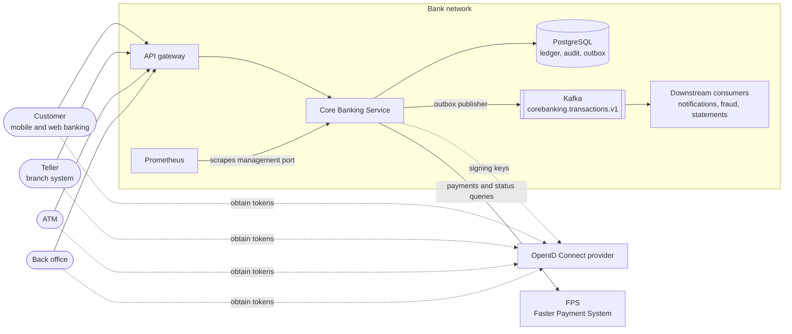
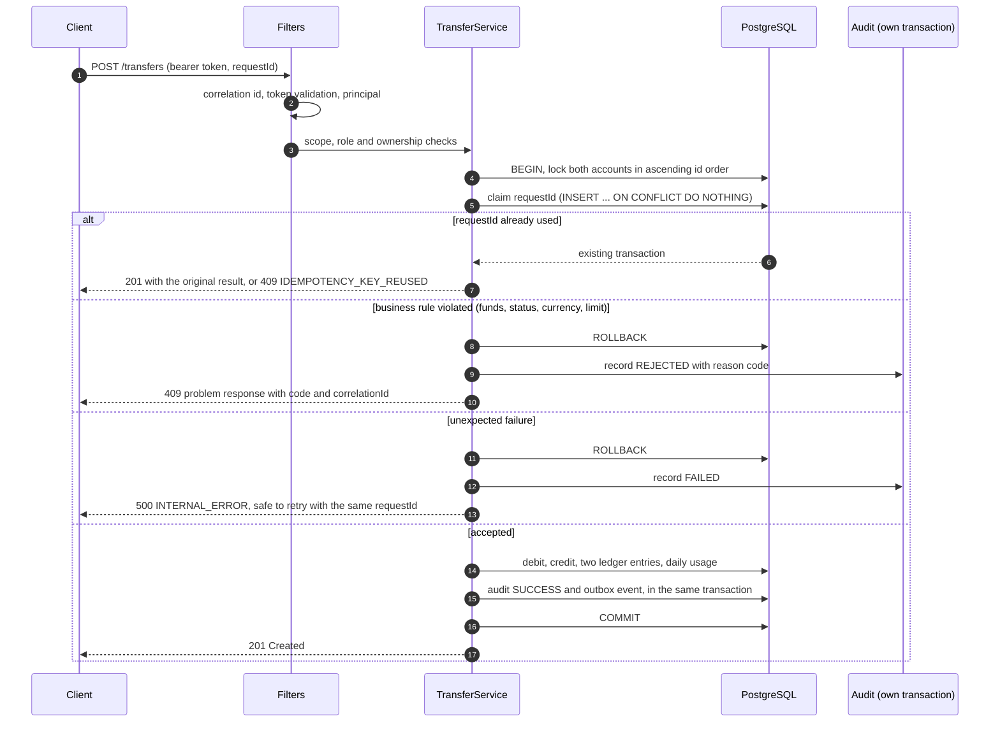
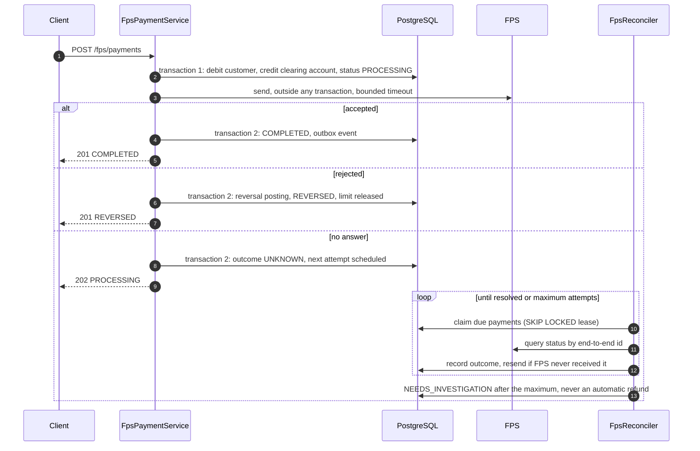

# Architecture

## Context

The service owns accounts, the double-entry ledger and the audit trail. It
does not authenticate anyone itself: callers present access tokens issued by
the bank's OpenID Connect provider, and the service maps each token to a bank
user or registered terminal (see
[ADR-0003](adr/0003-delegate-authentication-to-an-oidc-provider.md)).

## Modules

Packages are organised by business capability, each holding its web layer,
services and repositories.

| Package | Responsibility |
|---|---|
| `transfer` | Transfers between accounts at the bank |
| `fps` | Payments to other banks, their reconciliation and returns |
| `cash` | Teller deposits and withdrawals, four-eyes approvals, ATM withdrawals |
| `account` | Account queries, transaction history, back-office controls |
| `payee` | Saved payees (JPA) |
| `posting` | Shared posting engine: account locks, idempotency, limits, ledger postings, reversals |
| `ledger`, `transaction` | Ledger entries and transaction records |
| `audit` | Append-only audit trail and outcome metrics |
| `outbox`, `notification` | Integration events and an example consumer |
| `security` | Token validation, principals, authorization rules |
| `web`, `common` | Error responses, correlation ids, API description, money and time |

Every money movement goes through `posting`, so locking order, idempotency,
limits and ledger rules are implemented once.

## Anatomy of a transfer

A transfer either happens completely, with its ledger entries, audit record
and integration event, or leaves no trace except the audit record of the
rejected attempt.

## Payments to other banks

FPS payments cross a system boundary that no database transaction can span,
so they run in three steps:

See [ADR-0009](adr/0009-treat-payment-timeouts-as-unknown-and-reconcile.md)
and [ADR-0010](adr/0010-correct-postings-with-reversal-transactions.md).

## Consistency model

- **One database transaction per business step.** Balances, ledger entries,
  the transaction record, successful audit events, limit usage and outbox
  events are written together or not at all.
- **Pessimistic row locks in a global order** (ascending account id) under
  READ COMMITTED, so concurrent movements serialise per account without
  deadlocks ([ADR-0001](adr/0001-lock-accounts-in-ascending-id-order.md)).
- **Idempotency at the database**: the unique `request_id` decides which of
  two concurrent retries executes
  ([ADR-0002](adr/0002-idempotency-through-a-unique-request-id.md)).
- **Invariants enforced by PostgreSQL** as well as by the code: non-negative
  customer balances, append-only ledger and audit tables, four-eyes checks.
  See [database.md](database.md).
- **No network calls inside a database transaction.** FPS and Kafka are
  called after commit, so a slow dependency cannot hold locks or connections.

## Background work

| Job | Schedule | Concurrency control |
|---|---|---|
| FPS reconciliation | every 30 s | Lease on `transactions.next_attempt_at`, claimed with `FOR UPDATE SKIP LOCKED` |
| Outbox publication | every 1 s | Lease on `outbox_events.next_attempt_at`, same pattern |
| Outbox cleanup | hourly | Bounded batches of published events past retention |

Because every job claims work through leases in the database, any number of
instances can run them at the same time without leader election; each item
is processed by one instance at a time, and an item whose instance dies is
picked up when its lease expires.

## Deployment

The service is stateless: all state lives in PostgreSQL, so instances can be
added or replaced freely. Each instance serves the API on port 8080 and
probes and metrics on port 8081, which only the platform can reach. The
container image runs as an unprivileged user on a JRE-only base image. How
the design scales further is recorded in
[ADR-0012](adr/0012-scale-out-stateless-instances-on-one-primary-database.md).
Operations are described in the [runbook](runbook.md).
