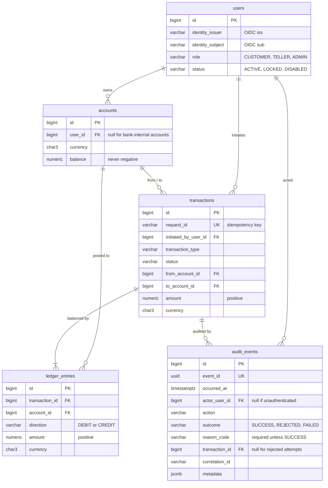

# Database

PostgreSQL 17. The schema is owned exclusively by Flyway migrations in
[`src/main/resources/db/migration`](../src/main/resources/db/migration).
Migrations merged to `main` are never edited.

## Entity relationships

## Invariants enforced by the database

| Invariant | Mechanism |
|---|---|
| A balance is never negative | `ck_accounts_balance_non_negative` |
| A request id is executed at most once | `uq_transactions_request_id` |
| Money cannot move from an account to itself | `ck_transactions_distinct_accounts` |
| Amounts are positive | `ck_transactions_amount_positive`, `ck_ledger_entries_amount_positive` |
| A ledger leg cannot be posted twice | `uq_ledger_entries_leg` |
| An external identity maps to exactly one user | `uq_users_external_identity` |
| Roles and statuses come from a closed set | `ck_users_role`, `ck_users_status` |
| The ledger is append-only | trigger `trg_ledger_entries_append_only` rejects `UPDATE` and `DELETE` |
| The audit trail is append-only | trigger `trg_audit_events_append_only` rejects `UPDATE` and `DELETE` |
| Every non-successful audit event has a reason | `ck_audit_events_reason` |
| Audited users and transactions cannot be deleted | foreign keys without `ON DELETE` actions |

Every completed transaction has ledger legs whose debits equal its credits.
This is guaranteed by the service writing both legs in the same database
transaction, and it is asserted by the integration tests.

## Monetary values

Amounts are `NUMERIC(19, 4)`. The API validates the per-currency number of
decimal places; the extra scale leaves room for currencies with three minor
units.

## Migrations

| Version | Purpose |
|---|---|
| V1 | Core ledger: accounts, transactions, ledger entries |
| V2 | Users identified by external (issuer, subject); account ownership; transaction initiator |
| V3 | Append-only business audit trail |
