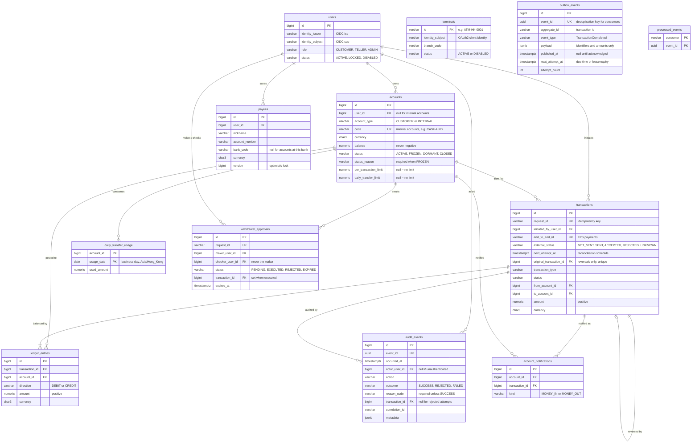

# Database

PostgreSQL 17. The schema is owned exclusively by Flyway migrations in
[`src/main/resources/db/migration`](../src/main/resources/db/migration).
Migrations merged to `main` are never edited.

## Entity relationships

## Invariants enforced by the database

| Invariant | Mechanism |
|---|---|
| A customer balance is never negative; internal accounts may be | `ck_accounts_balance_non_negative` |
| A customer account has an owner; an internal account has a code | `ck_accounts_owner_matches_type` |
| A request id is executed at most once | `uq_transactions_request_id` |
| Money cannot move from an account to itself | `ck_transactions_distinct_accounts` |
| Amounts are positive | `ck_transactions_amount_positive`, `ck_ledger_entries_amount_positive` |
| A ledger leg cannot be posted twice | `uq_ledger_entries_leg` |
| An external identity maps to exactly one user | `uq_users_external_identity` |
| Roles and statuses come from a closed set | `ck_users_role`, `ck_users_status` |
| The ledger is append-only | trigger `trg_ledger_entries_append_only` rejects `UPDATE` and `DELETE` |
| The audit trail is append-only | trigger `trg_audit_events_append_only` rejects `UPDATE` and `DELETE` |
| Every non-successful audit event has a reason | `ck_audit_events_reason` |
| Audited users and transactions cannot be deleted | foreign keys without `ON DELETE` actions |
| A frozen account records why | `ck_accounts_frozen_has_reason` |
| Status and reason come from closed sets | `ck_accounts_status`, `ck_accounts_status_reason` |
| Limits are positive | `ck_accounts_limits_positive` |
| An FPS payment carries its end-to-end id and destination once posted | `ck_transactions_fps_fields` |
| A transaction is reversed at most once | `uq_transactions_reversal_once` |
| A withdrawal is never approved by the teller who requested it | `ck_withdrawal_approvals_four_eyes` |
| An approval decision records who decided, when, and the executing transaction | `ck_withdrawal_approvals_decision` |
| A customer saves each destination once | `uq_payees_owner_destination` (`NULLS NOT DISTINCT`) |
| An event is stored once and handled once per consumer | `uq_outbox_events_event_id`, primary key of `processed_events` |

Every completed transaction has ledger legs whose debits equal its credits.
This is guaranteed by the service writing both legs in the same database
transaction, and it is asserted by the integration tests.

## Access technology

Accounts, transactions, ledger entries and audit events are accessed through
explicit SQL (`JdbcClient`). Payees are mapped with JPA. Each table is accessed
through exactly one of the two. See
[ADR-0006](adr/0006-explicit-sql-for-the-ledger-jpa-for-reference-data.md).

## Indexes and the queries they serve

Every secondary index exists for a named query. Primary keys and unique
constraints already index `id`, `request_id`, `event_id` and
`(identity_issuer, identity_subject)`; PostgreSQL does not index foreign key
columns automatically.

| Index | Query |
|---|---|
| `idx_accounts_user_id` | List a customer's accounts |
| `uq_payees_owner_destination` | List a customer's payees (leading `user_id`) |
| `idx_transactions_from_created_id` | Outgoing branch of the transaction history, keyset-paginated |
| `idx_transactions_to_created_id` | Incoming branch of the transaction history, keyset-paginated |
| `idx_ledger_entries_account_transaction` | All postings of an account |
| `idx_audit_events_actor_time` | Recent actions of a user |
| `idx_audit_events_transaction` | Audit trail of a transaction |
| `idx_audit_events_request_id` | What happened to a client request, including rejected ones |
| `idx_audit_events_on_behalf_time` | Everything performed on behalf of a customer |
| `idx_withdrawal_approvals_pending` | Pending approvals at a branch (partial index) |
| `idx_transactions_reconciliation` | Unresolved FPS payments that are due (partial index) |
| `idx_audit_events_action_time` | All events of a kind in a period, for example failed logins |
| `idx_outbox_events_unpublished` | Unpublished events that are due, and the backlog (partial index) |
| `idx_transactions_needs_investigation` | Escalated FPS payments, oldest first, and their count (partial index) |

Query plans are inspected with `QueryPlanInvestigationIT`, which is disabled in
CI because plan shapes depend on data volume and statistics. With 200,000
transactions over 200 accounts the history query executes as a Merge Append of
two index-only scans with no sort, in about 0.1 ms. See
[ADR-0005](adr/0005-keyset-pagination-for-transaction-history.md).

## Monetary values

Amounts are `NUMERIC(19, 4)`. The API validates the per-currency number of
decimal places; the extra scale leaves room for currencies with three minor
units.

## Migrations

| Version | Purpose |
|---|---|
| V1 | Core ledger: accounts, transactions, ledger entries |
| V2 | Users identified by external (issuer, subject); account ownership; transaction initiator |
| V3 | Append-only business audit trail |
| V4 | Indexes for account and history read paths |
| V5 | Saved payees, maintained through JPA with optimistic locking |
| V6 | Account status lifecycle, transfer limits and daily usage |
| V7 | Internal accounts (cash), deposit and withdrawal types, on-behalf-of audit attribution |
| V8 | Four-eyes approval of large teller withdrawals |
| V9 | Self-service terminal identities |
| V10 | FPS payment tracking, reversals, FPS clearing accounts, SYSTEM audit channel |
| V11 | Transactional outbox, consumer deduplication, example account notifications |
| V12 | Index of FPS payments escalated for investigation |
